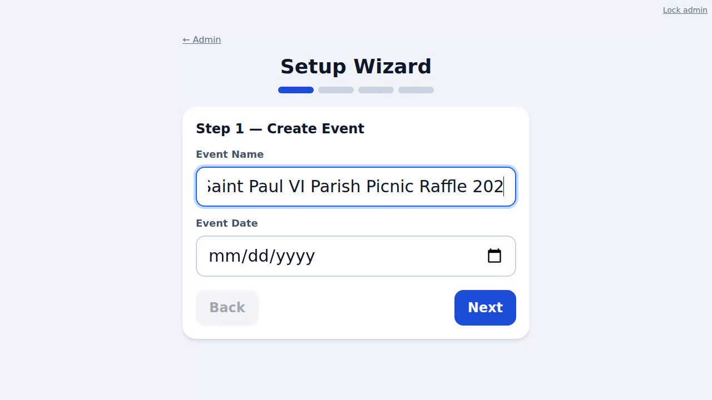

# Automated demo recorder

Drives a real Chromium browser through the raffle and records video
**automatically** — no manual screen capture. Two recorders:

- **`record-setup.mjs`** — the first-run setup/onboarding walkthrough (admin
  login → setup wizard → prize management → open sales). Run against an **empty**
  instance.
- **`record-demo.mjs`** — the operating workflow (sale → drawing → live TV
  display → pickup). **Seeds** the instance automatically if it is empty.

The finished, narrated cut is [`media/raffle-end-to-end.mp4`](media/raffle-end-to-end.mp4)
(see the repo README). Each recorder produces one of its source clips:

| Poster | Clip | Recorder |
| --- | --- | --- |
|  | first-run setup | `record-setup.mjs` |
|  | live TV board | `record-demo.mjs` |
|  | volunteer workflow | `record-demo.mjs` |

The individual `.webm` clips are **regenerated on demand** and are not committed
(only the final MP4 and these poster frames are). Each recorder writes its clip
to `media/raffle-*.webm` for the stitcher below.

## Run it

```bash
cd demo
npm install                 # installs Playwright (downloads a browser once)

# Setup walkthrough — point at a FRESH, empty server:
BASE_URL=http://localhost:8001 ADMIN_PIN=1234 node record-setup.mjs

# Operating demo — local server (auto-seeds if empty):
BASE_URL=http://localhost:8000 ADMIN_PIN=1234 npm run record

# …or against a deployed instance:
BASE_URL=https://your-service.run.app ADMIN_PIN=<admin-pin> npm run record
```

The finished video path is printed at the end (`VIDEO_SETUP=…`, `VIDEO_OPERATOR=…`,
`VIDEO_DISPLAY=…`).

## Narrated end-to-end video

`build_narrated.py` stitches the three clips into a single MP4
(`media/raffle-end-to-end.mp4`) with on-screen title cards and an offline
voice-over — no cloud services.

Three voice backends via `TTS_BACKEND`:

- **`piper`** — neural, most natural (recommended). Needs the `piper-tts` pip
  package and a downloaded voice model.
- **`pico`** (default) — SVOX Pico, smooth; Linux `libttspico-utils`.
- **`espeak`** — robotic fallback; Linux `espeak-ng`.

```bash
pip install imageio-ffmpeg pillow

# --- Neural voice (Piper) ---
pip install piper-tts
python -m piper.download_voices en_US-lessac-medium   # downloads to CWD
TTS_BACKEND=piper python demo/build_narrated.py        # run from the repo root
```

Windows PowerShell:

```powershell
pip install imageio-ffmpeg pillow piper-tts
python -m piper.download_voices en_US-lessac-medium
$env:TTS_BACKEND = "piper"
python demo\build_narrated.py           # -> demo\media\raffle-end-to-end.mp4
```

```bash
# --- Offline Linux voices (no model download) ---
sudo apt-get install -y libttspico-utils          # pico (default)
python demo/build_narrated.py
TTS_BACKEND=espeak python demo/build_narrated.py   # robotic fallback
```

`PIPER_MODEL` (name or full `.onnx` path) and `PIPER_DATA_DIR` (defaults to the
repo root, where `download_voices` puts the files) override the Piper voice.
Edit the title text and the timed narration cues near the bottom of
`build_narrated.py`. Title cards render with Pillow (auto-detects DejaVu on
Linux, Arial/Segoe on Windows), and everything is muxed with the ffmpeg bundled
by `imageio-ffmpeg` (H.264 + AAC).

## Notes

- Playwright records WebM (VP8), which plays in Chrome, Edge, Firefox and VLC.
  To convert to MP4: `ffmpeg -i display.webm -c:v libx264 -pix_fmt yuv420p display.mp4`.
- `PW_CHROME` can point at a pre-installed Chromium (e.g. in CI images); by
  default Playwright uses the browser it manages itself.
- Recording resolution is 1280×720; adjust `VIEWPORT` in `record-demo.mjs`.
